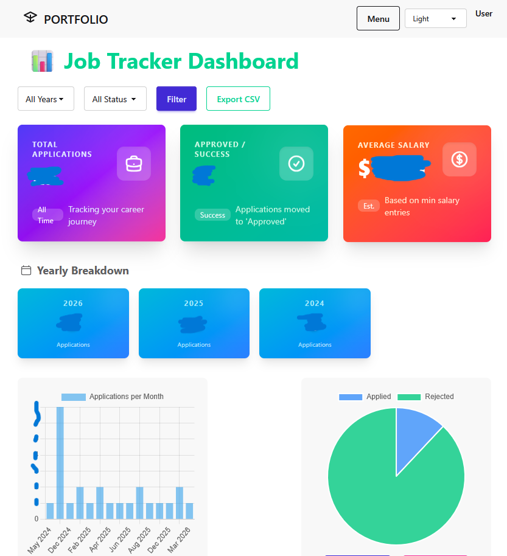
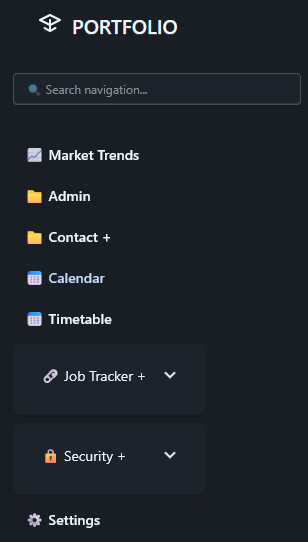
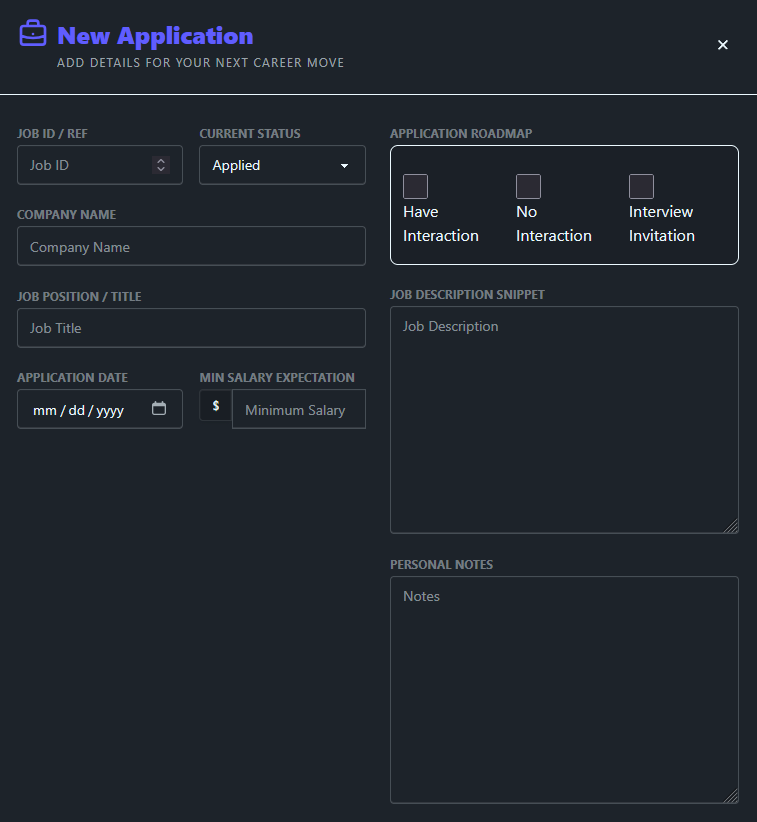

# My Portfolio

Welcome to my personal portfolio! This is a showcase of my projects, skills, and work experience.

---

## 👨‍💻 About Me

Hi, I'm <b>Qamarie Samsul!</b> I'm a <b>Software Engineer - Fullstack Developer (based in Malaysia)</b> passionate about building a customize web apps, mobile app. I specialize in python web, php web application and love creating what I enjoy building, also open to a <i>Job Offer.</i>

- 🔭 Currently working on: improve existing project.
- 🌱 Learning: [rapid mobile app dev, kotlin native].
- 📫 How to reach me: <a href="mailto:qamariesamsul.upsi@gmail.com?subject=Hello%20from%20GitHub">Email Me qamariesamsul.upsi@gmail.com</a>

---

## 🛠️ Skills & Technologies

<table>
  <tr>
    <th>Category</th>
    <th>Technologies</th>
  </tr>
  <tr>
    <td><b>Programming Languages</b></td>
    <td>Python, PHP, JavaScript, TypeScript</td>
  </tr>
  <tr>
    <td><b>Frameworks & Libraries</b></td>
    <td>Django, Svelte, HTMX, Tailwind, Alpine.js</td>
  </tr>
  <tr>
    <td><b>Databases</b></td>
    <td>PostgreSQL, SQLite</td>
  </tr>
  <tr>
    <td><b>Tools & Platforms</b></td>
    <td>Docker, Node.js, npm, VS Code, Windows Terminal, DB tool (inspect data)</td>
  </tr>
</table>

---

## 📁 Projects

###     Portfolio - Personal Productivity App
> This project is particularly help user manage their contacts, track job applications (with dashboard analytic), schedule events, and organize daily tasks in one centralized location. The inclusion of enterprise-grade security features makes it suitable for deployment in environments where data protection is a priority.

> learn about file upload, export charts and filtered information into download document.

> will add more internal app, that will help me a lot later.

**Tech Stack:** django + htmx + tailwind + alpinejs + sqlite

**Features:**
- Job Market trends
- Job Tracking & Dashboards analysis
- Application Security Management
- Manage ➡️ Side Navigation
- Search function ➡️ Side Navigation
- Calendar / add event / Agenda view.
- Timetable - a simple one.
- Security ➡️ monitoring.
- mobile friendly user interface

**Live Demo:** [Link] ❌

---

###   Personal Command Center
> Still a work in progress, will add more core application and feature to this project in the near future.

**Tech Stack:** svelte, typescript, node & npm, postgresql

**Features:**
- User Management
- Family Tracking (a detailed one), use GPS, Location. [map, track info, etc..]
- toggle registration page ON/OFF

**Live Demo:** [<a href="https://prsnl-cmd-center.vercel.app/" target="_blank" alt="Personal Project">Open Demo</a>]

---

## 📫 Connect With Me

---

## 🙏 Acknowledgments

- [Inspiration / <a href="https://www.youtube.com/@NetNinja" target="_blank">https://www.youtube.com/@NetNinja</a> ]
- [Inspiration / all YT Tech Spert]
- [Mentors/Contributors]

---

Thank you for visiting my portfolio! Feel free to reach out if you'd like to collaborate or just say hi. 😊
